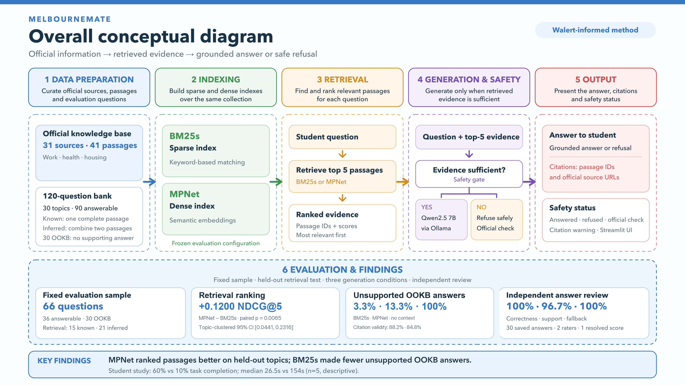
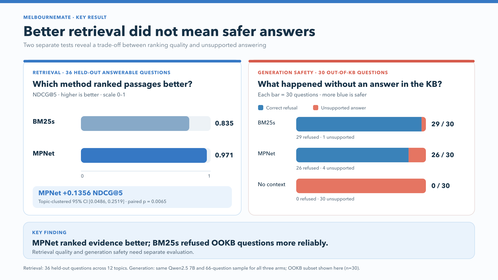
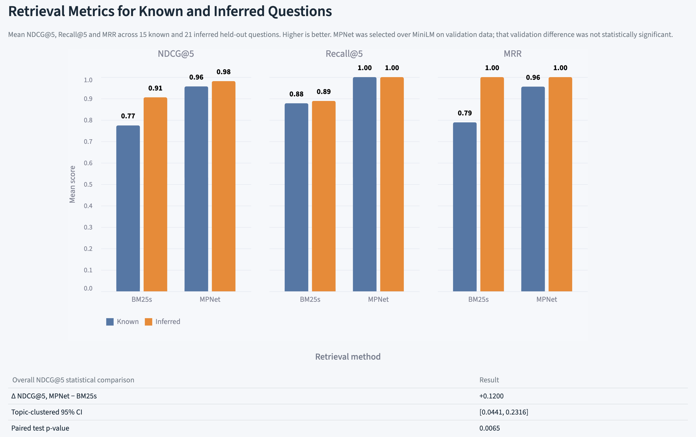
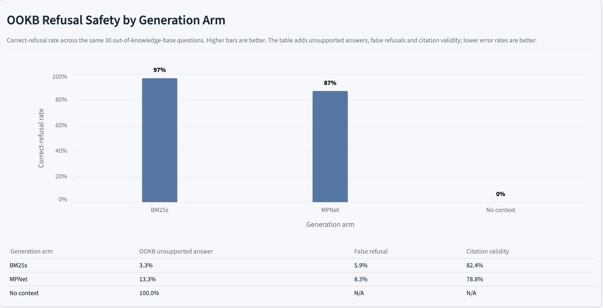

# MelbourneMate

MelbourneMate is an independent Test-Driven RAG project for international
students who need current official information about settling in Melbourne.
The project compares a BM25s lexical baseline with a QA-trained MPNet dense
retriever and evaluates whether retrieved evidence improves answer quality and
safe refusal behaviour.

## Contents

Use these links to find the project method, setup, commands and saved evidence.

- [From Walert to MelbourneMate](#from-walert-to-melbournemate)
- [Walert method and local tooling](#walert-method-and-local-tooling)
- [System overview](#system-overview)
- [Development setup](#development-setup)
- [Core commands](#core-commands)
- [Reproduce the evaluation evidence](#reproduce-the-evaluation-evidence)
- [Evaluation figures](#evaluation-figures)
- [Generation evaluation](#generation-evaluation)
- [Error analysis](#error-analysis)
- [Streamlit demo](#streamlit-demo)
- [Student study](#student-study)
- [References and acknowledgements](#references-and-acknowledgements)

## From Walert to MelbourneMate

Walert is the methodological baseline for MelbourneMate. The project adapts
Walert's known, inferred and out-of-knowledge-base question scenarios, graded
retrieval evaluation and explicit measurement of unanswered questions.

MelbourneMate extends that baseline with:

- a topic-level validation and held-out test split;
- BM25s versus pinned MPNet retrieval;
- Walert-style qrels with targeted checks for new MPNet candidates;
- topic-clustered confidence intervals and paired testing;
- grounded and no-context generation arms;
- deterministic citation checks and blind generated-answer review;
- immutable run manifests and data/configuration fingerprints;
- a local Ollama generator and Streamlit interface.

The projects use different domains, collections, questions, models and
protocols, so their numerical scores are not directly comparable. See
[`docs/walert-methodology-mapping.md`](docs/walert-methodology-mapping.md).

### Walert method and local tooling

MelbourneMate follows Walert's broad experimental sequence:

```text
validate data -> run BM25s -> run Dense -> calculate metrics -> compare runs
```

Walert uses separate scripts. MelbourneMate uses the project-local `mm` command
to automate the same sequence and reduce command errors. This does not make the
two projects' scores directly comparable.

## System overview



The diagram separates the live RAG path from the evaluation path. Official
sources are indexed for BM25s and MPNet retrieval, Qwen2.5 generates from the
retrieved evidence through local Ollama, and the safety gate answers only when
the available evidence is sufficient. Retrieval effectiveness and generation
safety are evaluated separately.

## Development setup

Use these steps to create a local environment and install the project, app and
test dependencies.

```bash
python3 -m venv .venv
source .venv/bin/activate
python -m pip install --upgrade pip
pip install -e ".[dense,app,dev]"
```

Do not commit virtual environments, model weights, `.env` files, caches or
personal participant data.

## Core commands

`mm` is the project's local command-line tool. Its entry point is defined in
[`pyproject.toml`](pyproject.toml), and its commands are implemented in
[`src/melbourne_mate/cli.py`](src/melbourne_mate/cli.py). Validate the formal
collection before running an experiment:

```bash
mm --data data/v1 validate
mm --data data/v1 quality
```

The Dense encoder decision used validation only:

```bash
mm --data data/v1 retrieve --arm dense --split validation \
  --encoder all-minilm --run-id s9-minilm-validation
mm --data data/v1 retrieve --arm dense --split validation \
  --encoder multi-qa-mpnet --run-id s9-mpnet-validation
mm --data data/v1 compare \
  --left runs/retrieval/s9-minilm-validation \
  --right runs/retrieval/s9-mpnet-validation --metric ndcg@5
```

After MPNet was frozen, BM25s and MPNet were run once on the held-out test:

```bash
mm --data data/v1 evaluate-retrieval --split test \
  --encoder multi-qa-mpnet --run-prefix recheck-yourname
```

The submitted rankings are in `runs/retrieval/s9-formal-bm25-test/` and
`runs/retrieval/s9-formal-mpnet-test/`. After the targeted qrels check, the
same rankings were rescored without tuning or rerunning either retriever:

```bash
mm --data data/v1 rescore-retrieval \
  --source-run runs/retrieval/s9-formal-bm25-test \
  --qrels review/targeted-qrels/qrels-final.txt \
  --run-id recheck-yourname-bm25-test
mm --data data/v1 rescore-retrieval \
  --source-run runs/retrieval/s9-formal-mpnet-test \
  --qrels review/targeted-qrels/qrels-final.txt \
  --run-id recheck-yourname-mpnet-test
mm --data data/v1 compare \
  --left runs/retrieval/recheck-yourname-bm25-test \
  --right runs/retrieval/recheck-yourname-mpnet-test \
  --out runs/retrieval/recheck-yourname-comparison.csv
```

The final submitted results are in `runs/retrieval/s9-final-bm25-test/`,
`runs/retrieval/s9-final-mpnet-test/` and
`runs/retrieval/s9-final-comparison.csv`. Each run ID is write-once.

## Reproduce the evaluation evidence

This table connects each reported result to its command, implementation and
saved output. It helps reviewers check the evidence or repeat one experiment.

| Result | Reproduction command | Code | Saved output |
|---|---|---|---|
| [Dense encoder choice](#core-commands) | [`mm retrieve` and `mm compare`](#core-commands) | [Retrieval package](src/melbourne_mate/retrieval/) | [MiniLM validation](runs/retrieval/s9-minilm-validation/) and [MPNet validation](runs/retrieval/s9-mpnet-validation/) |
| [BM25s versus MPNet](#core-commands) | [`mm evaluate-retrieval`](#core-commands) | [Metrics](src/melbourne_mate/evaluation/metrics.py) and [statistics](src/melbourne_mate/evaluation/stats.py) | [BM25s test](runs/retrieval/s9-final-bm25-test/), [MPNet test](runs/retrieval/s9-final-mpnet-test/) and [comparison CSV](runs/retrieval/s9-final-comparison.csv) |
| [Generation safety](#generation-evaluation) | [`mm evaluate-generation`](#generation-evaluation) | [Generation metrics](src/melbourne_mate/evaluation/generation_metrics.py) | [BM25s summary](runs/generation/s9-qwen25-20260927-bm25/summary.csv), [MPNet summary](runs/generation/s9-qwen25-20260927-mpnet/summary.csv) and [no-context summary](runs/generation/s9-qwen25-20260927-no-context/summary.csv) |
| [Error analysis](#error-analysis) | [`mm analyse-errors`](#error-analysis) | [Error-analysis code](src/melbourne_mate/evaluation/error_analysis.py) | [Report](runs/analysis/s9-error-analysis/report.md), [summary CSV](runs/analysis/s9-error-analysis/summary.csv) and [cases CSV](runs/analysis/s9-error-analysis/cases.csv) |

The commands below show the full arguments. Saved CSV files are committed so a
reviewer can inspect the reported values without downloading models or rerunning
Ollama.

### Evaluation figures

This summary figure keeps the primary retrieval result separate from the OOKB
generation-safety comparison:



The Streamlit evaluation view renders the committed run files. It does not
rerun retrieval or generation:





## Generation evaluation

This section reproduces the BM25s-grounded, MPNet-grounded and no-context
conditions. All three use the same Qwen2.5 model, questions and settings.

Install the local model, then run all three methods with one command:

```bash
ollama pull qwen2.5:7b-instruct
mm --data data/v1 validate
mm --data data/v1 evaluate-generation \
  --sample generation-sample.csv \
  --qrels review/targeted-qrels/qrels-final.txt \
  --run-prefix recheck-yourname \
  --model qwen2.5:7b-instruct
```

This creates BM25s, MPNet, and no-context runs with the same 66 questions and
settings. Use a new prefix when repeating the test.

Prepare the fixed 30-answer review from those saved runs:

```bash
mm --data data/v1 prepare-answer-review \
  --bm25-run runs/generation/s9-qwen25-20260927-bm25 \
  --mpnet-run runs/generation/s9-qwen25-20260927-mpnet \
  --no-context-run runs/generation/s9-qwen25-20260927-no-context \
  --out review/generation-s9
```

Elaine and Siriporn fill their own sheet without opening `key.csv`. After both
are complete, run `mm score-answer-review --review-dir review/generation-s9`.

## Error analysis

This section builds the final error report from saved retrieval and generation
runs. It does not rerun retrieval or Ollama.

```bash
mm --data data/v1 analyse-errors \
  --qrels review/targeted-qrels/qrels-final.txt \
  --bm25-retrieval runs/retrieval/s9-final-bm25-test \
  --mpnet-retrieval runs/retrieval/s9-final-mpnet-test \
  --bm25-generation runs/generation/s9-qwen25-20260927-bm25 \
  --mpnet-generation runs/generation/s9-qwen25-20260927-mpnet \
  --no-context-generation runs/generation/s9-qwen25-20260927-no-context \
  --out runs/analysis/recheck-yourname
```

The report uses the shared high-risk categories in
`src/melbourne_mate/evaluation/risk.py`.

## Streamlit demo

This section launches the chatbot and its evaluation charts for a simple project
demonstration. The app uses the frozen MPNet pipeline and local Ollama model.

Start Ollama, then launch the final MPNet chatbot:

```bash
ollama serve
streamlit run src/melbourne_mate/interface/app.py
```

Before a live presentation, warm the model once so the first timed question does
not include model-loading time:

```bash
ollama run qwen2.5:7b-instruct "Reply only OK."
```

The app streams the answer as it is generated and asks Ollama to keep Qwen loaded
for 30 minutes between questions. These demo improvements do not change the frozen
model, prompt, 512-token limit or evaluation settings.

The Evaluation results panel reads the committed run files and does not rerun an
experiment. Three retrieval panels compare held-out NDCG@5, Recall@5 and MRR for
BM25s and MPNet, split into known and inferred questions. A compact statistical
summary remains below the chart. The generation chart compares appropriate
response behaviour for known, inferred and out-of-knowledge-base questions; its
summary keeps unsupported-answer, citation-validity and truncation rates visible.
The four checked tasks and one citation warning are recorded in
`review/chatbot-test-s9/results.csv`. The app uses the same pipeline, final qrels,
frozen encoder and local model as the evaluation runs.

Create the 37-pair review sheet from the saved MPNet top-five rankings:

```bash
mm --data data/v1 qrels-pool \
  --run runs/retrieval/s9-formal-mpnet-test \
  --out review/targeted-qrels/recheck-yourname.csv
```

The submitted sheet is `review/targeted-qrels/s9-mpnet-candidates.csv`. It keeps
only candidates absent from the current qrels whose passage is in the same
category as the question or in a listed confusable topic pair.

Run the checks before handing work to another team member:

```bash
python -m pytest -q
ruff check src tests
```

Team responsibilities and the reviewed branch order are recorded in
[`docs/HANDOFF.md`](docs/HANDOFF.md).

## Student study

A small session compares MelbourneMate with searching official websites. The
study page shows a short voluntary notice, runs one untimed warm-up through the
full pipeline, then records each task's completion, time, confidence and trust
and a final would-use rating.

```bash
streamlit run src/melbourne_mate/interface/study_app.py
mm study-summary --study-dir study
```

Participant responses stay in `study/responses.csv` and `study/final.csv` on the
session computer and are not committed. The procedure, tasks and counterbalanced schedule are in
[`study/README.md`](study/README.md).

## References and acknowledgements

MelbourneMate's methodology and implementation were informed by the following
work:

- Pathiyan Cherumanal, S., Tian, L., Abushaqra, F. M., Magnossão de Paula,
  A. F., Ji, K., Ali, H., Hettiachchi, D., Trippas, J. R., Scholer, F., &
  Spina, D. (2024). *Walert: Putting Conversational Information Seeking
  Knowledge into Action by Building and Evaluating a Large Language
  Model-Powered Chatbot*. CHIIR '24, 401–405.
  <https://doi.org/10.1145/3627508.3638309>
- Lù, X. H. (2024). *BM25S: Orders of Magnitude Faster Lexical Search via
  Eager Sparse Scoring*. <https://arxiv.org/abs/2407.03618>
- Reimers, N., & Gurevych, I. (2019). *Sentence-BERT: Sentence Embeddings Using
  Siamese BERT-Networks*. EMNLP-IJCNLP, 3982–3992.
  <https://doi.org/10.18653/v1/D19-1410>
- Song, K., Tan, X., Qin, T., Lu, J., & Liu, T.-Y. (2020). *MPNet: Masked and
  Permuted Pre-training for Language Understanding*. NeurIPS 2020.
  <https://arxiv.org/abs/2004.09297>
- Qwen Team. (2024). *Qwen2.5 Technical Report*.
  <https://arxiv.org/abs/2412.15115>

The final dense retriever uses
[`sentence-transformers/multi-qa-mpnet-base-cos-v1`](https://huggingface.co/sentence-transformers/multi-qa-mpnet-base-cos-v1).
Generation uses `qwen2.5:7b-instruct` locally through
[Ollama](https://github.com/ollama/ollama), and the interface is built with
[Streamlit](https://streamlit.io/).

The official information sources used to construct the collection, together
with their access dates and verification outcomes, are recorded in
[`data/v1/sources.csv`](data/v1/sources.csv) and
[`data/v1/source-log.csv`](data/v1/source-log.csv). The detailed relationship
to Walert is documented in
[`docs/walert-methodology-mapping.md`](docs/walert-methodology-mapping.md).
